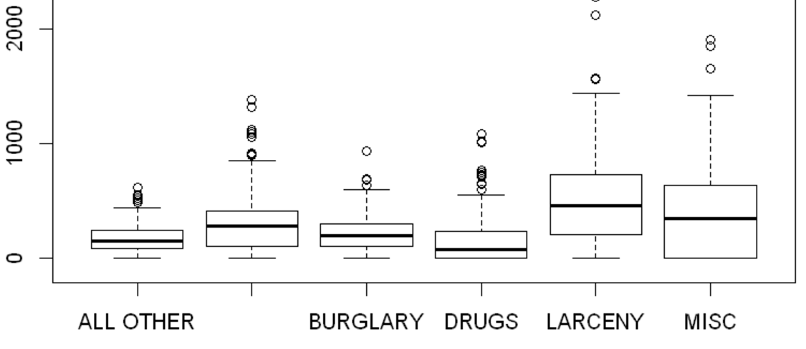
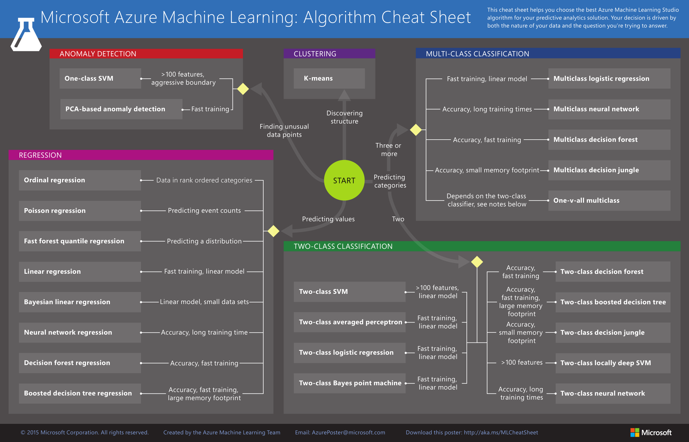
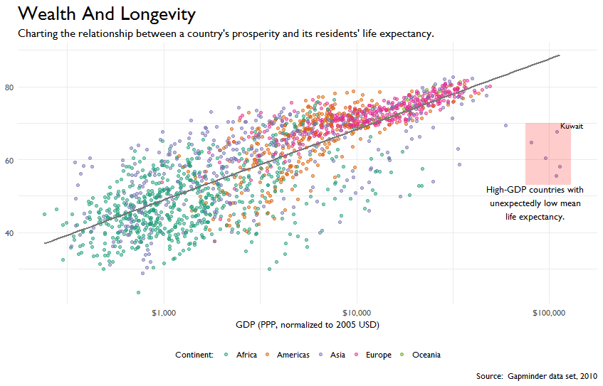
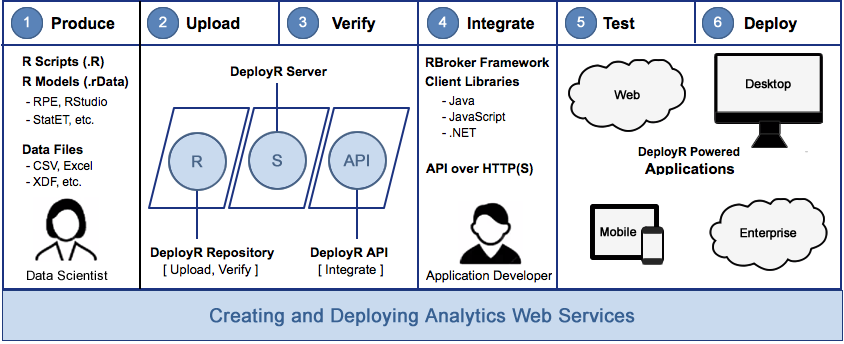
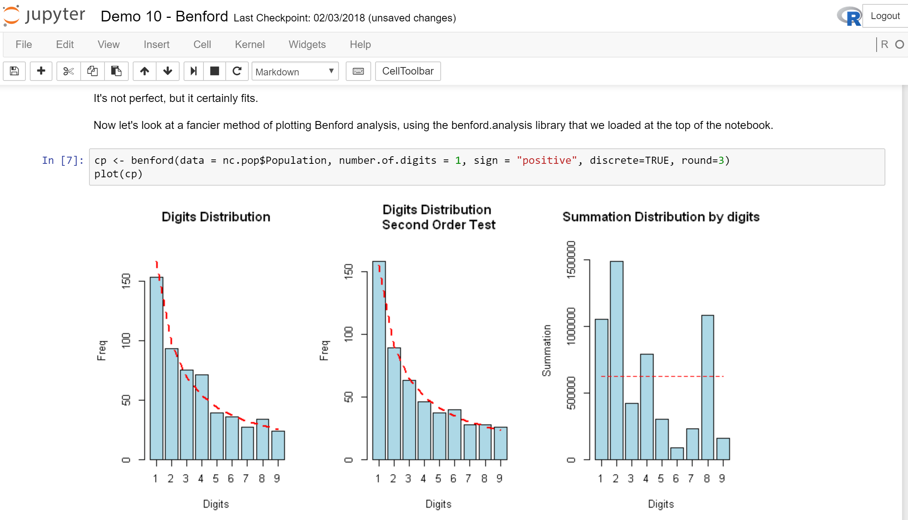
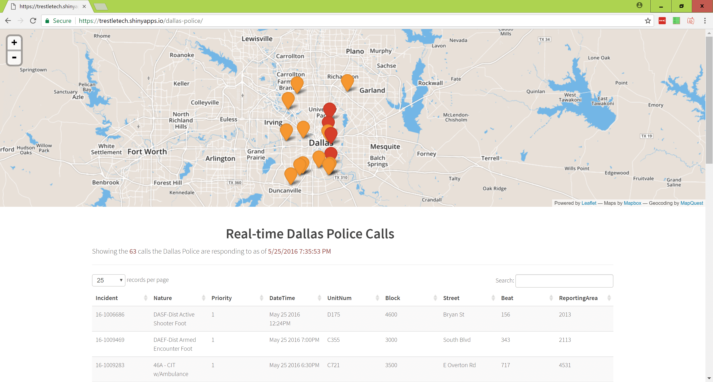

## Cleaning Is Half The Battle:  Launching A Data Science Project

<a href="https://www.catallaxyservices.com">Kevin Feasel</a> (<a href="https://twitter.com/feaselkl">@feaselkl</a>)
<a href="https://csmore.info/on/datascience">https://CSmore.info/on/datascience</a>

---

@title[Who Am I?]

@snap[west splitscreen]
<table>
	<tr>
		<td></td>
		<td><a href="https://csmore.info">Catallaxy Services</a></td>
	</tr>
	<tr>
		<td></td>
		<td><a href="https://curatedsql.com">Curated SQL</a></td>
	</tr>
	<tr>
		<td></td>
		<td><a href="https://wespeaklinux.com">We Speak Linux</a></td>
	</tr>
</table>
@snapend

@snap[east splitscreen]

	
	 
	<a href="https://www.twitter.com/feaselkl">@feaselkl</a>

@snapend

---?image=presentation/assets/background/2_1_philosophy.jpg&size=cover&opacity=15

### Data Adages

* "Clean" data is an aspiration, not a reality
* If data is stored in two places, there will inevitably be disagreements
* You will always have more questions than data
* Decision-makers will not know their questions until you have enough information to give them
* Data necessarily abstracts the particulars of time and place

Nevertheless, our job is to figure something out.

---

### Process

To deal with these considerations, we build and implement processes.  These processes give us structure and help us navigate some of the difficulties in managing data.

@div[left-50]

@divend

@div[right-50]
In today's talk, we will look at one particular process:  the Microsoft Team Data Science Process.
@divend

---?image=presentation/assets/background/2_2_motivation.jpg&size=cover&opacity=15

### Motivation

We will use the Team Data Science Process to uncover interesting information from the <a href="https://www.brentozar.com/archive/2018/01/2018-data-professionals-salary-survey-results/">2018 Data Professionals Salary Survey</a>.

At each step of the way, we will walk through implementation details and achieve a better understanding of data professional salaries.

---

@title[Business Understanding]

## Agenda
1. **Business Understanding**
2. Data Processing
3. Modeling
4. Deployment
5. What's Next?

---

### Business Understanding

Somebody higher up (typically on the business side of the house) wants a data science project done.  Your mission is to figure out as much about that person's vision as possible.

Your domain knowledge will be critical to success, but you should still find the champion(s) of your project and understand best their vision of success.

---

### Ask Questions

When interviewing your project champion or people on the business side, listen for the following types of questions:

* How much / how many?
* Which category does this belong to?
* How can we segment this data?
* Is this weird?
* Which option should I choose?

These questions help you determine which algorithms to use.

---

### Get A Specific Problem

Your goal is to nail down a **specific** problem, narrowing the scope to something achievable.

* Find a model which predicts quarterly sales to within 5% no later than 30 days into that quarter.
* Given a title and description for a product, tell me with at least 90% probability a listing category that Amazon will consider valid for this product.
* Determine which factors most affect the number of years the first owner holds onto our mid-range sedan.

---

### Looking For Data

Once you have an interesting question, start looking for data. Some of this data will be in-house and could be in databases, Excel, flat files, accessible through APIs, or even in reports.

Your champion will hopefully be able to point you in the right direction, but this part of the process requires legwork.

---

### Data Dictionary

Once you have a compendium of data sources, you will want to build a <strong>data dictionary</strong>, which helps you explain what different pieces of data actually mean.  A data dictionary typically tells you:

* Data type:  numeric, string, categorical, binary
* Data format:  CSV, SQL Server table, Hive table, etc.
* Size of data and number of records
* Enumeration of valid values (if categorical)
* Other domain rules (if known)

---

### End Result

Another thing to determine is, where does your end data need to be? Will there be a different engineering team expecting to call a microservice API?  Will you get a set of files each day and dump results into a warehouse?

This is generally a technical problem that an Engineering group will architect, although your champion might have insight here depending upon how the business side will need to use your results.

---

### Example

We work for Data Platform Specialists, a company dedicated to providing DBAs and other data platform professionals with valuable market knowledge. We have come into possession of a survey of data professionals and want to build insights that we can share with our client base.

---

### Example

---

### Example

Questions we can ask given our domain knowledge:

* **How much** money does a DBA make?
* **Which category** of DBA (junior, mid-level, senior) does this particular work?
* **How can we segment** the DBAs in our survey?
* Is this many hours per week **weird**?
* **Which option should I choose** as a career path? DBA? Data science? BI?

---

### Example

Narrowing this down with our champion and other stakeholders, we can get to the following question which we will endeavour to answer:

**How much money should we expect a data professional will make?**

---

### Example

As we review the survey data, we can start to see different shapes of data and begin to build a data dictionary.

For example, TelecommuteDaysPerWeek has six options:  less than 1, 1, 2, 3, 4, 5 or more. These are ordered options, meaning the numbers inherently matter.

By contrast, number of hours worked per week is an integer ranging from 5 to 200 (?!).

---

### Example

Our company wants to build a small website and allow people who have built profiles to get an estimate of how much they could be making in different roles.  Our job is to build a microservice API which returns a dollar amount based on inputs.

---

@title[Data Processing]

## Agenda
1. Business Understanding
2. **Data Processing**
3. Modeling
4. Deployment
5. What's Next?

---

### Data Processing

Data processing is made up of a few different activities:

* Data Gathering
* Data Cleansing
* Data Analysis

---

### Data Gathering

Data gathering will likely be an iterative process; as you flesh out your models and gain a better understanding of the problem, you will likely search several times for data from sources like:

* Internal proprietary data
* Open data sources (often governmental or academic)
* Paid APIs or data sources from third parties
* Survey data

---

### Data Gathering Example

In this example, we will stick to just the data professional survey. But if you want to take this further, a few additional data sources could be:

* PPP GDP per capita to normalize across countries.
* A geocoding data set to visualize results.
* Cost of living by ZIP code.
* Census information by ZIP code.
* Data from other surveys to add more to the sample.

---

### Data Cleansing

@div[left-50]

@divend

@div[right-50]
Data cleansing is half the battle.  That's the title, after all!
@divend

---

### Data Cleansing

Well, actually...

---

### Data Cleansing

Most of your time, you'll be a data plumber.

---

### Data Cleansing

General estimates that you will hear from data scientists is that they spend approximately 80% of their time cleaning data. If anything, this is an underestimation--based on my experiences, that number might be closer to 90%.

Simply getting the data is a start, but there's a long journey ahead.

---

### Data Cleansing

After grabbing relevant-looking data sets, you will want to join them together to gain insight from the mashup of different data sets. Common join activities include:

* Changing the grain of at least one data set
* Definining join criteria (because there is no obvious natural join key)
* Reshaping data to fit join criteria

---

### Data Cleansing

You will quickly find problems with your data sets, including (but not limited to):

* Mismatched, mislabeled, and incorrect data
* Records with missing data
* Duplicated records
* Data inconsistencies:  records conflicting with other records
* Misshapen flat files

---

### Data Cleansing - Mismatches

**Mislabeled** data:  when the label is incorrect.  Ex: on the data professional survey, a person who earns $50K per year accidentally typing $500K per year. If you can fix the label, this data becomes useful. If you cannot, it may throw off your analysis.

**Mismatched** data:  data joined together which should not have been.
							
**Incorrect** data: when data other than the label is incorrect. Ex: a person works 200 hours per week?

---

### Data Cleansing - Missing Data

People don't always fill out the entirety of every form. When we're missing important data, we have a few options available to us:

* Delete the row (okay with a small percent)
* Substitute with a dummy value
* Substitute with the mean, median, or mode
* Use regression and replace with the regressed value

None of these options is perfect, but the last three can help salvage incomplete records.

---

### Data Cleansing - Duplicates

If your data source does not have duplicate protection in place, you might end up with multiple entries representing the same thing. Sometimes it's easy to catch those:  you might be able to use a DISTINCT clause to remove duplicates. Other times, you will have to dig further.

---

### Data Inconsistencies

Independent systems may end up with inconsistent data due to reasons like typos, transcription errors, etc. Sometimes subtle differences in data sets can lead to differing results. Potential solutions include:
* Make one data set canonical
* Institute rules (pick the lower number, pick the later date, etc.)

---

### Misshapen Data

Data stored in flat files or textual format can end up misshapen--some rows may not have enough delimiters (or maybe too many), there could be newlines in the middle of a record, or the file cuts off in the middle of a record.

This is a problem with flat files and certain semi-structured data formats. It is not a problem with relational databases, where data shape is enforced.

---

### Data Shaping

There are several techniques we can use to reshape data to make it easier to analyze:

* Vectorize words (turn each word into a number)
* Turn strings into factors (categorical data)
* Normalize values (transform numeric data to have a mean of 0 and standard deviation of 1)
* Bin data, converting continuous variables to discrete

---?image=presentation/assets/background/4_5_demo.jpg&size=cover&opacity=15

### Demo Time

---

### Data Analysis

The most common technique for data analysis at this point is Exploratory Data Analysis (EDA). Examples of EDA techniques include:

* Getting count and cardinality of features
* Building out 5-number summaries
* Visualizing data, especially with box plots and histograms
* Determining correlation between variables

---

### Data Analysis - Cardinality

@div[left-50]

@divend

@div[right-50]
The cardinality of a feature is the number of unique values.
@divend

---

### Data Analysis - 5-Number Summary

The five-number summary of a feature tells us the minimum value, value at the 25% mark, value at the 50% mark, value at the 75% mark, and maximum value. The mean technically is not part of the five-number summary, but can be useful.

---

### Data Analysis - Box Plot

Box plots show us the five-number summary by group.

---

### Data Analysis - Histogram

Histograms show us the spread of a single variable.

---

### Data Analysis - Correlation

Here we have two comparisons, depth vs table and x vs y. Depth and table are mildly negatively correlated; this isn't a problem. The x and y variables, however, are very highly correlated. Some algorithms may exhibit problems if you include both x and y in your analysis.

---?image=presentation/assets/background/4_5_demo.jpg&size=cover&opacity=15

### Demo Time

---

@title[Modeling]

## Agenda
1. Business Understanding
2. Data Processing
3. **Modeling**
4. Deployment
5. What's Next?

---

### Modeling

Modeling has five major steps:

* Feature Engineering
* Feature Selection
* Model Selection & Training
* Model Evaluation
* Model Tuning

---

### Feature Engineering

Feature engineering involves creating relevant features from raw data. Examples include:

* Indicator flags (Age >= 21, Income >= $100K)
* Calculations (ClickThroughRate = Clicks / Impressions)
* Geocoding latitude and longitude from an address
* Aggregating data (by day, by hour, etc.)
* Text processing -- turning words into arbitrary numbers for numeric analysis (TF-IDF, Word2Vec)

---

### Feature Selection

We use feature selection to winnow down the available set of features.  There are several reasons to do this:

* Collinearity -- one feature can predict another, making analysis less precise.
* Make analysis easier for a human to understand by removing irrelevant or redundant features.
* More efficient training with fewer variables.
* Reduce the risk of an irrelevant or redundant feature causing spurious correlation.

---

### Spurious Correlation

(<a href="http://www.tylervigen.com/spurious-correlations">Source</a>)

---

### Model Training

We take some percentage of our total data and designate it for training / validation, and the remainder is for evaluation. There are no hard rules on percentages, but typically, we reserve 70-80% for training.

There are four major branches of algorithms:
* Supervised learning
* Unsupervised learning
* Self-supervised learning
* Reinforcement learning

---

### Supervised Learning

Supervised learning models require known answers (labels). We train a model to map input data to those labels in order to have the model predict the correct answer for unlabeled records. Major classes of supervised learning models and their pertinent driving questions include:

* Regression -- How much?
* Classification -- Which?
* Recommendation -- What next?

---

### Unsupervised Learning

With unsupervised learning, we do not know the answers beforehand and try to derive answers. We can use unsupervised learning to drive toward a supervised problem by giving data analysts insight into the nature of the problem. Major classes of unsupervised learning models and their pertinent driving questions include:

* Clustering -- How can we segment?
* Dimensionality reduction -- What of this data is useful?

---

### Self-Supervised Learning

This is a subset of supervised learning, but with the popularity of neural networks, has come into its own. We use heuristics to guesstimate labels and train the model that way. An example of self-supervised learning is predicting the next word in a document based on previous words.

Self-supervised learning typically happens with neural networks.

---

### Reinforcement Learning

@div[left-50]

@divend

@div[right-50]
Reinforcement learning is where we train an agent to observe its environment and use those environmental clues to make a decision.
@divend

---

### Choose An Algorithm

Once you understand the nature of the problem, you can choose among viable algorithms based on the following major trade-offs:

* Accuracy
* Training time
* Ability to understand the result
* Number of parameters
* Number of features allowed

---

---

### Algorithms

@div[left-50]

@divend

@div[right-50]
Once you have an algorithm, features, and labels (if supervised), you can train the algorithm. Training a model is solving a system of equations, minimizing a loss function.
@divend

---

### Validate The Model

Instead of using up all of our data for training, we typically want to perform some level of validation within our training data set to ensure that we are on the right track and are not overfitting.

Overfitting happens when a model latches on to the particulars of a data set, leaving it unable to generalize to new data. To test for overfitting, test your model against unseen data. If there is a big dropoff in model accuracy between training and testing data, you are likely overfitting.

---

### Cross-Validation

Cross-validation is a technique where we slice and dice the training data, training our model with different subsets of the total data. The purpose here is to find a model which is fairly robust to the particulars of a subset of training data, thereby reducing the risk of overfitting.

---

### Tune The Model

Most models have **hyperparameters**. For neural networks, the number of training epochs is a hyperparameter. For random forests, hyperparameters include things like the size of each decision tree and the number of trees.

We tune hyperparameters using our validation data set.

---

### Evaluate The Model

Model evaluation happens when we send new data to the model that it has not seen during the training and validation process. We have to be careful not to let any information leak into the training data, meaning that we should never feed aggregates of training + evaluation data to a model.

If we fail to safeguard this data, we can end up overfitting our model to the test data, leaving it less suited for the real-world data outside of our sample.

---

### Evaluate The Model

@div[left-50]

@divend

@div[right-50]
You can also build a fitness function to evaluate certain types. Genetic algorithms are a common tool for this.
@divend

---?image=presentation/assets/background/4_5_demo.jpg&size=cover&opacity=15

### Demo Time

---

@title[Deployment]

## Agenda
1. Business Understanding
2. Data Processing
3. Modeling
4. **Deployment**
5. What's Next?

---

### Deployment

Back in the day, one team would build a solution in an analytics language (e.g., R) but you would not go to production with that. Instead, an implementation team would rewrite your model in C++ or some other fast language. Those days of research versus implementation teams using completely different languages are now (mostly) gone.

---

### Deployment

Welcome to the era of the microservice:  many small services dedicated to providing a single answer to a single problem. Most microservices are exposed via web calls, although other forms of interoperation are still possible. The big benefit to web calls is that I can write my service in R, you can call it in Python, and then someone can call your service from .NET.

---

### Deployment

Once you have a model ready to go, there are tools which make it relatively easy to deploy scalable predictive services.  For example, DeployR:

---

### Deployment

You can also build your own services.  Stacks that I've put into production include:

* WebAPI (C#) ==> SQL Server Machine Learning Services ==> Microsoft Machine Learning with R
* WebAPI (C#) ==> Nginx ==> Flask/Gunicorn ==> Keras with Python

With a microservices architecture, you're trying to plug in these new APIs while not forcing everybody else to change their skills.

---

### Deployment

SQL Server Machine Learning Services, in particular, is great when the input data is already stored in SQL Server. With certain types of models, you can make "real-time" predictions. Our scenario was complex enough that we pre-trained a large number of models and stored the results in SQL Server for later prediction.

---

### Deployment

@div[left-50]

@divend

@div[right-50]
Another option is notebooks, which help you record your work for subsequent review. Jupyter (Julia + Python + R) and Apache Zeppelin are two great examples of notebooks.
@divend

---

### Deployment

@div[left-50]

@divend

@div[right-50]
Shiny is an interactive visualization product combining JavaScript and R. This is more for visualizing data rather than integrating with other services.
@divend

---

@title[What's Next?]

## Agenda
1. Business Understanding
2. Data Processing
3. Modeling
4. Deployment
5. **What's Next?**

---

### What's Next?

After go-live, the job is not complete.

It is important to keep checking the efficacy of models. Model shift happens, where a model might have been good at one point in time but becomes progressively worse over time as circumstances change.

You may also find out that your training/testing data was not truly indicative of real-world data.

---

### What's Next?

Occasionally, you will want to take new production data and retrain the model, so keep track of your model's predictions and actual outcomes so you can determine the model's efficacy.

Depending upon your choice of algorithm, you might be able to update the existing model with the latest information, feeding those efficacy results back into the model.

Some algorithms, however, require you to retrain from scratch.

---

### What's Next?

Regardless of model efficacy, you will want to confer with those stakeholders and ensure that your model fits their needs. Then, repeat the process.

In a production scenario, you will start with a Minimum Viable Product (MVP) to gauge interest.  From there, you can expand the base of predictions, increase accuracy, make the service faster, or add new functionality.

---

### Moral Of The Story

A data plumber's work is never done.

---

@title[Wrapping Up]

### Wrapping Up

Over the course of today's talk, we have covered the Microsoft Team Data Science Process as well as a pragmatic implementation of a data science workflow. Following a stable process allows you to maximize the chances of developing a high-quality and effective model.

---

### Wrapping Up

To learn more, go here:  <a href="https://csmore.info/on/datascience">https://CSmore.info/on/datascience</a>

And for help, contact me:  <a href="mailto:feasel@catallaxyservices.com">feasel@catallaxyservices.com</a> | <a href="https://www.twitter.com/feaselkl">@feaselkl</a>
